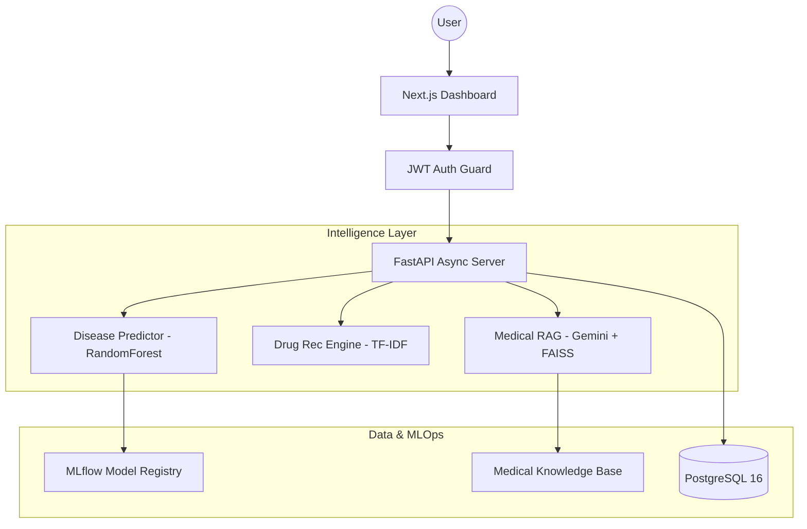

# 🏥 AI-Powered Health Intelligence System

A production-grade, full-stack healthcare intelligence platform powered by advanced AI — providing automated disease prediction, drug recommendations, and a high-performance RAG-based medical chatbot.


---

## ✨ Features

### 🖥️ Premium User Experience
- **Glassmorphic Dashboard:** A modern, high-performance UI built with Next.js 16 and custom CSS.
- **Real-time Analytics:** Automated tracking of disease predictions and chat sessions.
- **System Health Monitor:** Live status tracking for API, ML Models, and RAG pipelines.

### 🔬 Intelligence Pipelines
- **Disease Prediction:** RandomForest-based classification with symptom encoding and confidence scoring. Features a hybrid loading system (Local fallback + MLflow).
- **Drug Recommendations:** NLP-driven engine using TF-IDF vectorization and Cosine Similarity to match medical conditions with top-rated treatments.
- **Medical AI Chatbot (RAG):** Advanced Retrieval-Augmented Generation pipeline:
    - **Embeddings:** Google Gemini `embedding-001`.
    - **Vector Store:** High-speed FAISS CPU index.
    - **Reranking:** LLM-based contextual compression using Gemini `1.5 Pro`.
    - **Generation:** Summarized, context-aware answers via Gemini `2.5 Flash`.

### 🛡️ Enterprise Core
- **Secure Auth:** JWT-based authentication with bcrypt password hashing.
- **Async Architecture:** Fully asynchronous backend (FastAPI + SQLAlchemy + asyncpg).
- **Robust MLOps:** Integrated MLflow for model tracking and versioning.

---

## 🏗️ Architecture



---

## 📁 Project Structure

```
├── backend/
│   ├── src/
│   │   ├── api/v1/endpoints/    # Route handlers (Auth, Disease, Drugs, Chat, Dashboard)
│   │   ├── core/                # Config, security, logging
│   │   ├── db/                  # Database engine & session
│   │   ├── models/              # SQLAlchemy ORM models
│   │   ├── schemas/             # Pydantic validation schemas
│   │   └── services/            # Business logic + RAG & ML pipelines
│   ├── ml/                      # Training pipelines & model artifacts
│   │   ├── scripts/             # Vector index builders
│   │   └── training/            # Model training scripts (MLflow)
│   ├── alembic/                 # Database migrations
│   └── pyproject.toml           # Python dependencies
├── frontend/
│   ├── src/app/                 # Next.js App Router (Dashboard, Auth, Chat)
│   ├── src/lib/                 # API client, auth context
│   └── src/types/               # TypeScript type definitions
├── docker-compose.yml           # Full stack orchestration
└── README.md
```

---

## 🚀 Getting Started

### Prerequisites
- Python 3.11+
- Node.js 20+
- PostgreSQL 16+
- Google Gemini API Key

### 🐳 Quick Start (Docker)

```bash
# 1. Clone & Setup env
cp backend/.env.example backend/.env

# 2. Start all services
docker-compose up -d

# Access:
# Frontend  → http://localhost:3000
# Backend   → http://localhost:8000
# API Docs  → http://localhost:8000/docs
```

### 🛠️ Manual Development Setup

#### 1. Backend
```bash
cd backend
python -m venv venv
venv\Scripts\activate          # Windows
# source venv/bin/activate     # Linux/Mac

pip install -e ".[dev]"
cp .env.example .env           # Fill in DATABASE_URL & GOOGLE_API_KEY
alembic upgrade head           # Create database tables
uvicorn src.main:app --reload
```

#### 2. Frontend
```bash
cd frontend
npm install
npm run dev
```

---

## 📊 Knowledge Base & Training

### Initializing the Medical Chatbot (RAG)
1. Place medical PDF, TXT, or MD files in `backend/ml/data/knowledge_base/`.
2. Generate the vector index:
```bash
cd backend
python -m ml.scripts.build_vector_index
```

### Training the Disease Model
```bash
cd backend
python -m ml.training.disease_trainer
```

---

## 🛠️ Tech Stack

- **Frontend:** Next.js 16 (App Router), TypeScript, Vanilla CSS (Glassmorphism)
- **Backend:** FastAPI, SQLAlchemy (Async), Pydantic v2, Structlog
- **AI/ML:** Google Gemini 2.5 Flash & 1.5 Pro, FAISS, scikit-learn, LangChain
- **Database:** PostgreSQL 16
- **MLOps:** MLflow, Docker Compose
- **CI/CD:** Ruff (Lint), Mypy (Types), Pytest (Async tests)

---

## 📄 License

Developed as a state-of-the-art AI Healthcare platform.
